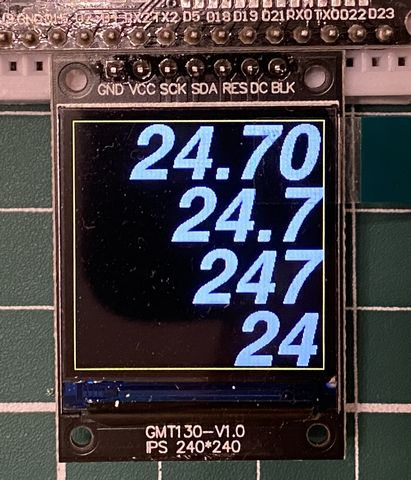

# u8g2_font_FreeSansBoldOblique

## 概要

M5Unified / LovyanGFX で使用できる、時刻やセンサー値の表示を小型ディスプレイにフィットするフォントを用意しました<BR>
FreeSansの太斜字フォント(FreeSansBoldOblique)をU8g2形式でASCIIコード0x20（空白）,0x2E-0x3A（./0123456789:）だけを登録しています<BR>
| ポイント | 適用 | イメージ | ラベル名 |
|---------|------|--------:|---------|
| 92pt    | 240x240, 2行用 |  | u8g2_font_FreeSansBoldOblique92pt7b |
| 40pt    | 240x240, 4行用 |  | u8g2_font_FreeSansBoldOblique40pt7b |
| 42pt    | 160x80,  1行用 |  | u8g2_font_FreeSansBoldOblique42pt7b |
| 24pt    | 160x80,  2行用 |  | ライブラリ内既存フォント<BR>FreeSansBoldOblique24pt7b |
| 32pt    | 128x64,  1行用 |  | u8g2_font_FreeSansBoldOblique32pt7b |
| 18pt    | 128x64,  2行用 |  | ライブラリ内既存フォント<BR>FreeSansBoldOblique18pt7b |
| 18pt    | "℃"文字のみ |  | u8g2_font_FreeSansBoldOblique18pt7ba |

オマケで温度表示に使用する「℃」のみが含まれる18ptのフォントも入れてあります<BR>




## 動作確認環境

このソースコードは、PlatformIO で確認しています<BR>
ハードウェアは、M5Unifiedで動作する環境（動作確認したのはM5StickCのみ）または、<BR>
DOIT ESP32 DEVKIT + 1.3inch ST7789 240x240ディスプレイです<BR>

## 使用方法

宣言：
```
#include <stdint.h>
#define U8G2_FONT_SECTION(name) 
#include "u8g2_font_FreeSans.h"
static const lgfx::U8g2font u8g2font92(u8g2_font_FreeSansBoldOblique92pt7b);
```
指定：<BR>
setFont(&u8g2font92); のように指定します<BR>

右寄せレイアウトの参考として、フォントごとにDrawParameter_XXpt_Yline()の関数を用意しているので参考にしてください<BR>

## 関連リンク

使用例（温湿度表示）：<BR>
https://github.com/cosmoois/SwitchBotMeterViewer<BR>
M5Unified：<BR>
https://github.com/m5stack/M5Unified<BR>
フォント作成方法：<BR>
https://github.com/tanakamasayuki/u8g2_font_ilfont<BR>
